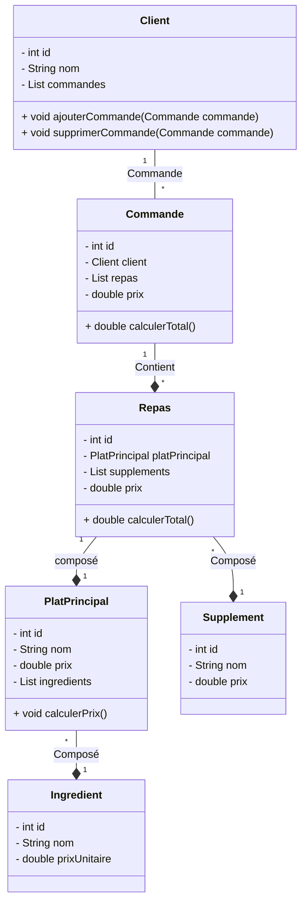
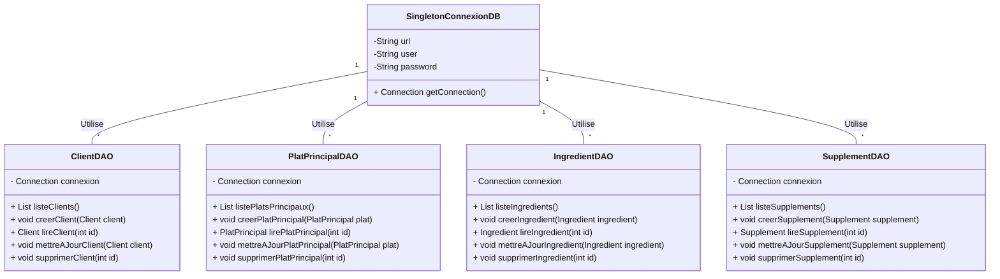

# Examen Java 2024/25

## 1. Diagrammes de Classe

### 1. Diagramme de classe principale:


### 2. Digramme de classe DAO:


## 2. Diagramme MLD
````plantuml
@startuml

!theme plain
top to bottom direction
skinparam linetype ortho

class client {
   nom: varchar(100)
   id: int
}
class ingredient {
   nom: varchar(100)
   prix: decimal(10,2)
   id: int
}
class platprincipal {
   nom: varchar(100)
   id: int
}
class platprincipal_ingredient {
   plat_principal_id: int
   ingredient_id: int
}
class supplement {
   nom: varchar(100)
   prix: decimal(10,2)
   id: int
}

platprincipal_ingredient  -[#595959,plain]-^  ingredient               : "ingredient_id:id"
platprincipal_ingredient  -[#595959,plain]-^  platprincipal            : "plat_principal_id:id"
@enduml

````
## 3. Tables MySQL

### Client Table
```sql
CREATE TABLE Client (
    id INT PRIMARY KEY AUTO_INCREMENT,
    nom VARCHAR(100) NOT NULL
);
```

### Ingredient Table
```sql
CREATE TABLE Ingredient (
    id INT PRIMARY KEY AUTO_INCREMENT,
    nom VARCHAR(100) NOT NULL,
    prix DECIMAL(10,2) NOT NULL
);
```

### PlatPrincipal Table
```sql
CREATE TABLE PlatPrincipal (
    id INT PRIMARY KEY AUTO_INCREMENT,
    nom VARCHAR(100) NOT NULL
);
```

### Supplement Table
```sql
CREATE TABLE Supplement (
    id INT PRIMARY KEY AUTO_INCREMENT,
    nom VARCHAR(100) NOT NULL,
    prix DECIMAL(10,2) NOT NULL
);
```

### Junction Table for PlatPrincipal and Ingredient
```sql
CREATE TABLE PlatPrincipal_Ingredient (
    plat_principal_id INT,
    ingredient_id INT,
    PRIMARY KEY (plat_principal_id, ingredient_id),
    FOREIGN KEY (plat_principal_id) REFERENCES PlatPrincipal(id),
    FOREIGN KEY (ingredient_id) REFERENCES Ingredient(id)
);
```

## 4. Classes Java

### Client.java
```java
public class Client {
    private int id;
    private String nom;
    private List<Commande> commandes;

    public Client(int id, String nom, List<Commande> commandes) {
        this.id = id;
        this.nom = nom;
        this.commandes = commandes;
    }
}
```

### Commande.java
```java
public class Commande {
    private int id;
    private Client client;
    private List<Repas> repas;
    private double prix;


    public Commande(int id, Client client, List<Repas> repas) {
        this.id = id;
        this.client = client;
        this.repas = repas;
    }

    private void calculatePrix() {
        for (Repas repas : repas) {
            this.prix += repas.getPrix();
        }
    }

    public Commande(int id, Client client) {
        this.id = id;
        this.client = client;
        this.repas = new ArrayList<>();
    }

    public void ajouterRepas(Repas repas) {
        this.repas.add(repas);
    }

    public void deleteRepas(Repas repas) {
        this.repas.remove(repas);
    }
}
```
### PlatPrincipal.java
````java
public class PlatPrincipal {
private  int id;
private String nom;
private double prix;
private List<Ingredient> ingredients;

    public PlatPrincipal(int id, String nom, List<Ingredient> ingredients) {
        this.id = id;
        this.nom = nom;
        this.ingredients = ingredients;
        this.calculatePrice();
    }

    private void calculatePrice() {
        for (Ingredient ingredient : ingredients) {
            this.prix += ingredient.getPrix();
        }
    }
}
````
### Commande.java
````java
public class Commande {
private int id;
private Client client;
private List<Repas> repas;
private double prix;


    public Commande(int id, Client client, List<Repas> repas) {
        this.id = id;
        this.client = client;
        this.repas = repas;
    }

    private void calculatePrix() {
        for (Repas repas : repas) {
            this.prix += repas.getPrix();
        }
    }}
````
### Ingredient.java
````java
public class Ingredient {
    private  int id;
    private String nom;
    private double prix;

    public Ingredient(int id, String nom, double prix) {
        this.id = id;
        this.nom = nom;
        this.prix = prix;
    }}
````
### Repas.java
````java
public class Repas {
    private int id;
    private PlatPrincipal platPrincipal;
    private List<Supplement> supplement;
    private double prix;

    public Repas(int id, PlatPrincipal platPrincipal, List<Supplement> supplement) {
        this.id = id;
        this.platPrincipal = platPrincipal;
        this.supplement = supplement;
        this.calculatePrice();
    }

    private void calculatePrice() {
        this.prix = platPrincipal.getPrix();
        for (Supplement supplement : supplement) {
            this.prix += supplement.getPrix();
        }

        this.prix += platPrincipal.getPrix();
    }
}
````
### Supplement.java

````java
public class Supplement {
    private  int id;
    private String nom;
    private  double prix;

    public Supplement(int id, String nom, double prix) {
        this.id = id;
        this.nom = nom;
        this.prix = prix;
    }

}
````
## 5.  
## 6. 
## 7. 
## 8. 
## 9. 
## 10. 
## 11. 
## 12. 
