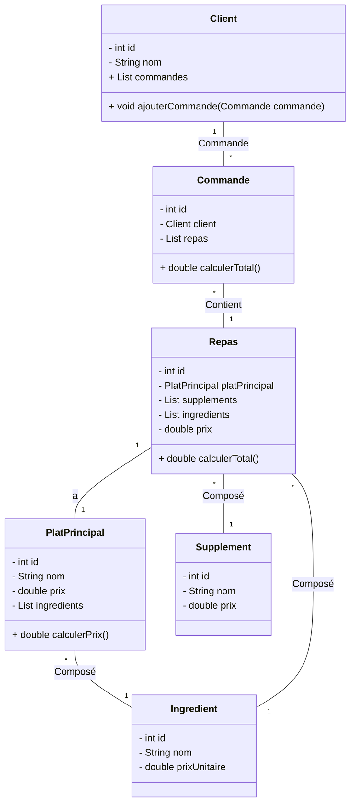

# Examen Java 2024/25

## 1. Diagramme de classe:

```mermaid
classDiagram
    class Client {
        - int id
        - String nom
        + List<Commande> commandes
      + void ajouterCommande(Commande commande)
    }

%%    class ClientDAO {
%%        + List<Client> listeClients()
%%        + void creerClient(Client client)
%%        + Client lireClient(int id)
%%        + void mettreAJourClient(Client client)
%%        + void supprimerClient(int id)
%%    }

    class PlatPrincipal {
        - int id
        - String nom
        - double prix
        - List<Ingredient> ingredients
        + double calculerPrix()
    }

%%    class PlatPrincipalDAO {
%%        + List<PlatPrincipal> listePlatsPrincipaux()
%%        + void creerPlatPrincipal(PlatPrincipal plat)
%%        + PlatPrincipal lirePlatPrincipal(int id)
%%        + void mettreAJourPlatPrincipal(PlatPrincipal plat)
%%        + void supprimerPlatPrincipal(int id)
%%    }

    class Ingredient {
        - int id
        - String nom
        - double prixUnitaire
    }

%%    class IngredientDAO {
%%        + List<Ingredient> listeIngredients()
%%        + void creerIngredient(Ingredient ingredient)
%%        + Ingredient lireIngredient(int id)
%%        + void mettreAJourIngredient(Ingredient ingredient)
%%        + void supprimerIngredient(int id)
%%    }

    class Supplement {
        - int id
        - String nom
        - double prix
    }

%%    class SupplementDAO {
%%        + List<Supplement> listeSupplements()
%%        + void creerSupplement(Supplement supplement)
%%        + Supplement lireSupplement(int id)
%%        + void mettreAJourSupplement(Supplement supplement)
%%        + void supprimerSupplement(int id)
%%    }

    class Repas {
        - int id
        - PlatPrincipal platPrincipal
        - List<Supplement> supplements
        - List<Ingredient> ingredients
        - double prix
        + double calculerTotal()
    }

    class Commande {
        - int id
        - Client client
        - List<Repas> repas
        + double calculerTotal()
    }

    Client "1" -- "*" Commande : Commande
    PlatPrincipal "*" -- "1" Ingredient: Composé
    Repas "1" -- "1" PlatPrincipal : a
    Repas "*" -- "1" Ingredient : Composé
    Repas "*" -- "1" Supplement: Composé
    Commande "*" -- "1" Repas: Contient

```

## 2. Diagramme MLD

## 3. Tables MySQL

```mysql
```

## 4. 
## 5.  
## 6. 
## 7. 
## 8. 
## 9. 
## 10. 
## 11. 
## 12. 
