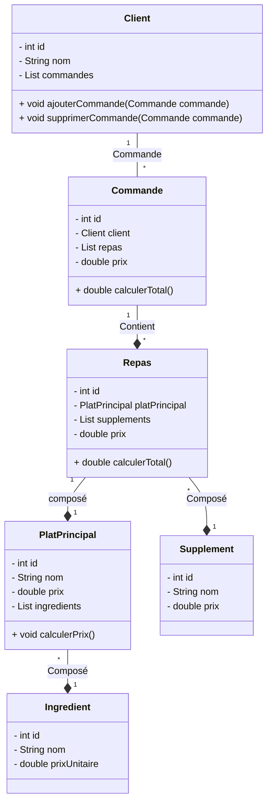

# Examen Java 2024/25

## 1. Diagrammes de Classe

### 1. Diagramme de classe principale:


### 2. Digramme de classe DAO:

```mermaid
classDiagram
    class ClientDAO {
        - Connection connexion
        + List<Client> listeClients()
        + void creerClient(Client client)
        + Client chercheClient(int id)
        + void modifierClient(Client client)
        + void supprimerClient(int id)
    }

    class PlatPrincipalDAO {
        - Connection connexion
        + List<PlatPrincipal> listePlatsPrincipaux()
        + void ajouterPlatPrincipal(PlatPrincipal plat)
        + PlatPrincipal cherchePlatPrincipal(int id)
        + void modifierPlatPrincipal(PlatPrincipal plat)
        + void supprimerPlatPrincipal(int id)
    }

    class IngredientDAO {
        - Connection connexion
        + List<Ingredient> listeIngredients()
        + void ajouterIngredient(Ingredient ingredient)
        + Ingredient chercheIngredient(int id)
        + void modifierIngredient(Ingredient ingredient)
        + void supprimerIngredient(int id)
    }

    class SupplementDAO {
        - Connection connexion
        + List<Supplement> listeSupplements()
        + void ajouterSupplement(Supplement supplement)
        + Supplement chercheSupplement(int id)
        + void modifierSupplement(Supplement supplement)
        + void supprimerSupplement(int id)
    }

    class CommandeDAO {
        - Connection connexion
        + List<Supplement> listeCommandes()
        + void ajouterCommande(Commande commande)
        + Commande chercheCommande(int id)
        + void modifierCommande(Commande commande)
        + void supprimerCommande(int id)
    }

    class RepasDAO {
        - Connection connexion
        + List<Supplement> listeRepass()
        + void ajouterRepas(Repas repas)
        + Repas chercheRepas(int id)
        + void modifierRepas(Repas repas)
        + void supprimerRepas(int id)
    }

    class SingletonConnexionDB {
        -String url
        -String user
        -String password
        + Connection getConnection()
    }

    SingletonConnexionDB "1" -- "*" ClientDAO: Utilise
    SingletonConnexionDB "1" -- "*" PlatPrincipalDAO: Utilise
    SingletonConnexionDB "1" -- "*" IngredientDAO: Utilise
    SingletonConnexionDB "1" -- "*" SupplementDAO: Utilise
    SingletonConnexionDB "1" -- "*" CommandeDAO: Utilise
    SingletonConnexionDB "1" -- "*" RepasDAO: Utilise
```


## 2. Diagramme MLD
````plantuml
@startuml

!theme plain
top to bottom direction
skinparam linetype ortho

class client {
   nom: varchar(100)
   id: int
}
class commande {
   client_id: int
   id: int
}
class commande_repas {
   commande_id: int
   repas_id: int
}
class ingredient {
   nom: varchar(100)
   prix: decimal(10,2)
   id: int
}
class platprincipal {
   nom: varchar(100)
   id: int
}
class platprincipal_ingredient {
   platprincipal_id: int
   ingredient_id: int
}
class repas {
   platprincipal_id: int
   id: int
}
class repas_supplement {
   repas_id: int
   supplement_id: int
}
class supplement {
   nom: varchar(100)
   prix: decimal(10,2)
   id: int
}

commande                  -[#595959,plain]-^  client                   : "client_id:id"
commande_repas            -[#595959,plain]-^  commande                 : "commande_id:id"
commande_repas            -[#595959,plain]-^  repas                    : "repas_id:id"
platprincipal_ingredient  -[#595959,plain]-^  ingredient               : "ingredient_id:id"
platprincipal_ingredient  -[#595959,plain]-^  platprincipal            : "platprincipal_id:id"
repas                     -[#595959,plain]-^  platprincipal            : "platprincipal_id:id"
repas_supplement          -[#595959,plain]-^  repas                    : "repas_id:id"
repas_supplement          -[#595959,plain]-^  supplement               : "supplement_id:id"
@enduml

````
## 3. Tables MySQL

### Client Table
```sql
CREATE TABLE Client (
                        id INT PRIMARY KEY AUTO_INCREMENT,
                        nom VARCHAR(100) NOT NULL
);
```

### PlatPrincipal Table
```sql
CREATE TABLE PlatPrincipal (
    id INT PRIMARY KEY AUTO_INCREMENT,
    nom VARCHAR(100) NOT NULL
);
```

### Ingredient Table
```sql
CREATE TABLE Ingredient (
    id INT PRIMARY KEY AUTO_INCREMENT,
    nom VARCHAR(100) NOT NULL,
    prix DECIMAL(10, 2) NOT NULL
);
```

### Supplement Table
```sql
CREATE TABLE Supplement (
    id INT PRIMARY KEY AUTO_INCREMENT,
    nom VARCHAR(100) NOT NULL,
    prix DECIMAL(10, 2) NOT NULL
);
```

### Junction Table for PlatPrincipal and Ingredient
```sql
CREATE TABLE PlatPrincipal_Ingredient (
    platprincipal_id INT,
    ingredient_id INT,
    FOREIGN KEY (platprincipal_id) REFERENCES PlatPrincipal(id),
    FOREIGN KEY (ingredient_id) REFERENCES Ingredient(id),
    PRIMARY KEY (platprincipal_id, ingredient_id)
);
```

### Repas Table
```sql
CREATE TABLE Repas (
    id INT PRIMARY KEY AUTO_INCREMENT,
    platprincipal_id INT NOT NULL,
    FOREIGN KEY (platprincipal_id) REFERENCES PlatPrincipal(id)
);
```

### Junction Table for Repas and Supplement
```sql
CREATE TABLE Repas_Supplement (
    repas_id INT,
    supplement_id INT,
    FOREIGN KEY (repas_id) REFERENCES Repas(id),
    FOREIGN KEY (supplement_id) REFERENCES Supplement(id),
    PRIMARY KEY (repas_id, supplement_id)
);
```

### Commande Table
```sql
CREATE TABLE Commande (
    id INT PRIMARY KEY AUTO_INCREMENT,
    client_id INT NOT NULL,
    FOREIGN KEY (client_id) REFERENCES Client(id)
);
```

### Junction Table for Commande and Repas
```sql
CREATE TABLE Commande_Repas (
    commande_id INT,
    repas_id INT,
    FOREIGN KEY (commande_id) REFERENCES Commande(id),
    FOREIGN KEY (repas_id) REFERENCES Repas(id),
    PRIMARY KEY (commande_id, repas_id)
);
```


## 4. Classes Java

### Client.java
```java
public class Client {
    private int id;
    private String nom;
    private List<Commande> commandes;

    public Client(int id, String nom, List<Commande> commandes) {
        this.id = id;
        this.nom = nom;
        this.commandes = commandes;
    }
}
```

### Commande.java
```java
public class Commande {
    private int id;
    private Client client;
    private List<Repas> repas;
    private double prix;


    public Commande(int id, Client client, List<Repas> repas) {
        this.id = id;
        this.client = client;
        this.repas = repas;
    }

    private void calculatePrix() {
        for (Repas repas : repas) {
            this.prix += repas.getPrix();
        }
    }

    public Commande(int id, Client client) {
        this.id = id;
        this.client = client;
        this.repas = new ArrayList<>();
    }

    public void ajouterRepas(Repas repas) {
        this.repas.add(repas);
    }

    public void deleteRepas(Repas repas) {
        this.repas.remove(repas);
    }
}
```
### PlatPrincipal.java
````java
public class PlatPrincipal {
private  int id;
private String nom;
private double prix;
private List<Ingredient> ingredients;

    public PlatPrincipal(int id, String nom, List<Ingredient> ingredients) {
        this.id = id;
        this.nom = nom;
        this.ingredients = ingredients;
        this.calculatePrice();
    }

    private void calculatePrice() {
        for (Ingredient ingredient : ingredients) {
            this.prix += ingredient.getPrix();
        }
    }
}
````
### Commande.java
````java
public class Commande {
private int id;
private Client client;
private List<Repas> repas;
private double prix;


    public Commande(int id, Client client, List<Repas> repas) {
        this.id = id;
        this.client = client;
        this.repas = repas;
    }

    private void calculatePrix() {
        for (Repas repas : repas) {
            this.prix += repas.getPrix();
        }
    }}
````
### Ingredient.java
````java
public class Ingredient {
    private  int id;
    private String nom;
    private double prix;

    public Ingredient(int id, String nom, double prix) {
        this.id = id;
        this.nom = nom;
        this.prix = prix;
    }}
````
### Repas.java
````java
public class Repas {
    private int id;
    private PlatPrincipal platPrincipal;
    private List<Supplement> supplement;
    private double prix;

    public Repas(int id, PlatPrincipal platPrincipal, List<Supplement> supplement) {
        this.id = id;
        this.platPrincipal = platPrincipal;
        this.supplement = supplement;
        this.calculatePrice();
    }

    private void calculatePrice() {
        this.prix = platPrincipal.getPrix();
        for (Supplement supplement : supplement) {
            this.prix += supplement.getPrix();
        }

        this.prix += platPrincipal.getPrix();
    }
}
````
### Supplement.java

````java
public class Supplement {
    private  int id;
    private String nom;
    private  double prix;

    public Supplement(int id, String nom, double prix) {
        this.id = id;
        this.nom = nom;
        this.prix = prix;
    }

}
````

### SingletonConnexionDB.java
````java
public class SingletonConnexionDB {
    static final private String url = "jdbc:mysql://localhost:3306/ExamenJava2425";
    static final private String user = "root";
    static final private String password = "yahya";

    public static Connection getConnection() throws SQLException {
        try {
            Connection con = DriverManager.getConnection(url, user, password);
//            System.out.println("Connection with DB established");
            return con;
        } catch (SQLException e) {
            System.out.println("Problem with DB");
            throw new SQLException(e);
        }
    }
}


````
## 5.  Classes DAO

### Classes ClientDAO
````java
public class ClientDAO {
    private Connection connection;

    public List<Client> listeClients() throws SQLException {
        List<Client> clients = new ArrayList<Client>();

        connection = SingletonConnexionDB.getConnection();
        PreparedStatement ps = connection.prepareStatement("SELECT * FROM client");
        ResultSet rs = ps.executeQuery();
        while (rs.next()) {
            int id = rs.getInt("id");
            String nom = rs.getString("nom");
            Client client = new Client(id, nom);
            clients.add(client);

        }
        return clients;
    }

    public void ajouterClient(Client client) throws SQLException {
        connection = SingletonConnexionDB.getConnection();
        PreparedStatement ps = connection.prepareStatement("INSERT INTO client VALUES(?, ?)");
        ps.setInt(1, client.getId());
        ps.setString(2, client.getNom());
        ps.executeUpdate();
    }

    public void supprimerClient(int id) throws SQLException {
        connection = SingletonConnexionDB.getConnection();
        PreparedStatement ps = connection.prepareStatement("DELETE FROM client WHERE id = ?");
        ps.setInt(1, id);
        ps.executeUpdate();
    }

    public void modifierClient(Client client) throws SQLException {
        connection = SingletonConnexionDB.getConnection();
        PreparedStatement ps = connection.prepareStatement("UPDATE client SET nom = ? WHERE id = ?");
        ps.setString(1, client.getNom());
        ps.setInt(2, client.getId());
        ps.executeUpdate();
    }

    public Client chercheClient(int id) throws SQLException {
        connection = SingletonConnexionDB.getConnection();
        PreparedStatement ps = connection.prepareStatement("SELECT * FROM client WHERE id = ?");
        ps.setInt(1, id);
        ResultSet rs = ps.executeQuery();
        if (rs.next()) {
            return new Client(rs.getInt("id"), rs.getString("nom"));
        }
        return null;
    }


}
````

### Classe PlatPrincipalDAO
````java
public class PlatPrincipalDAO {
    private Connection connection;

    public static void main(String[] args) throws SQLException {
        PlatPrincipalDAO platPrincipalDAO = new PlatPrincipalDAO();
        System.out.println(platPrincipalDAO.listePlatsPrincipaux());
    }

    //    public List<>
    public List<PlatPrincipal> listePlatsPrincipaux() throws SQLException {
        List<PlatPrincipal> platPrincipals = new ArrayList<>();
        connection = SingletonConnexionDB.getConnection();
        PreparedStatement preparedStatement = connection.prepareStatement("SELECT * FROM platprincipal");
        ResultSet resultSet = preparedStatement.executeQuery();

        while (resultSet.next()) {
            int id = resultSet.getInt("id");
            String nom = resultSet.getString("nom");
            PlatPrincipal platPrincipal = new PlatPrincipal(id, nom, getIngredientForPlat(id));
            platPrincipals.add(platPrincipal);
        }
        preparedStatement.executeQuery();

        return platPrincipals;
    }

    private List<Ingredient> getIngredientForPlat(int id) throws SQLException {
        List<Ingredient> ingredients = new ArrayList<>();
        connection = SingletonConnexionDB.getConnection();
        PreparedStatement preparedStatement = connection.prepareStatement("SELECT i.id, i.nom, i.prix FROM platprincipal as pp join examenjava2425.platprincipal_ingredient pi on pp.id = pi.platprincipal_id  JOIN examenjava2425.ingredient i on i.id = pi.ingredient_id WHERE pp.id = ?;");
        preparedStatement.setInt(1, id);
        ResultSet resultSet = preparedStatement.executeQuery();
        while (resultSet.next()) {
            int idIngredient = resultSet.getInt("i.id");
            String nom = resultSet.getString("i.nom");
            double prix = resultSet.getDouble("i.prix");
            Ingredient ingredient = new Ingredient(idIngredient, nom, prix);
            ingredients.add(ingredient);
        }
        return ingredients;
    }

}
````


### RepasDAO
````java
public class RepasDAO {
    private Connection connection;
    private PlatPrincipalDAO platPrincipalDAO;
    private SupplementDAO supplementDAO;

    public List<Repas> listeRepas() throws SQLException {
        List<Repas> repas = new ArrayList<>();
        List<PlatPrincipal> platsprincipales = platPrincipalDAO.listePlatsPrincipaux();
        List<Supplement> supplements = supplementDAO.listeSupplements();
        connection = SingletonConnexionDB.getConnection();
        PreparedStatement preparedStatement = connection.prepareStatement("SELECT  * from repas join examenjava2425.repas_supplement rs on rs.repas_id = repas.id;");
        ResultSet resultSet = preparedStatement.executeQuery();
        while (resultSet.next()) {
            int id_repas = resultSet.getInt(0);
            int id_plat = resultSet.getInt(1);
            int id_supplement = resultSet.getInt(2);
            List<Supplement> supplements1 = new ArrayList<>();
            supplements1.add(supplements.get(id_supplement));
            repas.add(new Repas(id_repas, platsprincipales.get(id_plat), supplements1));
        }

        return repas;
    }
    public Repas chercheRepas(int id) throws SQLException {
        String query = "SELECT * FROM Repas WHERE id = ?";
        connection = SingletonConnexionDB.getConnection();
        try (PreparedStatement stmt = connection.prepareStatement(query)) {
            stmt.setInt(1, id);
            ResultSet rs = stmt.executeQuery();
            if (rs.next()) {
                Repas repas = new Repas(
                        rs.getInt("id"),
                        new PlatPrincipalDAO(connection).cherchePlatPrincipal(rs.getInt("platprincipal_id"))
                );
                chargerSupplements(repas);
                return repas;
            }
        }
        return null;
    }

    public void ajouterRepas(Repas repas) throws SQLException {
        String query = "INSERT INTO Repas (platprincipal_id) VALUES (?)";
        connection = SingletonConnexionDB.getConnection();
        try (PreparedStatement stmt = connection.prepareStatement(query, Statement.RETURN_GENERATED_KEYS)) {
            stmt.setInt(1, repas.getPlatPrincipal().getId());
            stmt.executeUpdate();

            ResultSet rs = stmt.getGeneratedKeys();
            if (rs.next()) {
                repas.setId(rs.getInt(1));
                sauvegarderSupplements(repas);
            }
        }
    }

    public void supprimerRepas(int id) throws SQLException {
        // First delete related supplements associations
        supprimerSupplementsDeRepas(id);

        // Then delete the repas itself
        String query = "DELETE FROM Repas WHERE id = ?";
        try (PreparedStatement stmt = connection.prepareStatement(query)) {
            stmt.setInt(1, id);
            stmt.executeUpdate();
        }
    }

    public void modifierRepas(Repas repas) throws SQLException {
        String query = "UPDATE Repas SET platprincipal_id = ? WHERE id = ?";
        try (PreparedStatement stmt = connection.prepareStatement(query)) {
            stmt.setInt(1, repas.getPlatPrincipal().getId());
            stmt.setInt(2, repas.getId());
            stmt.executeUpdate();

            // Update supplements
            supprimerSupplementsDeRepas(repas.getId());
            sauvegarderSupplements(repas);
        }
    }

    private void chargerSupplements(Repas repas) throws SQLException {
        String query = "SELECT s.* FROM Supplement s " +
                "JOIN Repas_Supplement rs ON s.id = rs.supplement_id " +
                "WHERE rs.repas_id = ?";
        try (PreparedStatement stmt = connection.prepareStatement(query)) {
            stmt.setInt(1, repas.getId());
            ResultSet rs = stmt.executeQuery();
            while (rs.next()) {
                Supplement supplement = new Supplement(
                        rs.getInt("id"),
                        rs.getString("nom"),
                        rs.getDouble("prix")
                );
                repas.ajouterSupplement(supplement);
            }
        }
    }

    private void sauvegarderSupplements(Repas repas) throws SQLException {
        String query = "INSERT INTO Repas_Supplement (repas_id, supplement_id) VALUES (?, ?)";
        connection = SingletonConnexionDB.getConnection();
        try (PreparedStatement stmt = connection.prepareStatement(query)) {
            for (Supplement supplement : repas.getSupplements()) {
                stmt.setInt(1, repas.getId());
                stmt.setInt(2, supplement.getId());
                stmt.executeUpdate();
            }
        }
    }

    private void supprimerSupplementsDeRepas(int repasId) throws SQLException {
        String query = "DELETE FROM Repas_Supplement WHERE repas_id = ?";
        try (PreparedStatement stmt = connection.prepareStatement(query)) {
            stmt.setInt(1, repasId);
            stmt.executeUpdate();
        }
    }

    // Additional utility methods

    public List<Repas> chercheTousRepas() throws SQLException {
        List<Repas> repas = new ArrayList<>();
        String query = "SELECT * FROM Repas";
        connection = SingletonConnexionDB.getConnection();
        try (Statement stmt = connection.createStatement()) {
            ResultSet rs = stmt.executeQuery(query);
            while (rs.next()) {
                Repas r = new Repas(
                        rs.getInt("id"),
                        new PlatPrincipalDAO(connection).cherchePlatPrincipal(rs.getInt("platprincipal_id"))
                );
                chargerSupplements(r);
                repas.add(r);
            }
        }
        return repas;
    }

    public List<Repas> chercheRepasParPlatPrincipal(int platPrincipalId) throws SQLException {
        List<Repas> repas = new ArrayList<>();
        String query = "SELECT * FROM Repas WHERE platprincipal_id = ?";
        try (PreparedStatement stmt = connection.prepareStatement(query)) {
            stmt.setInt(1, platPrincipalId);
            ResultSet rs = stmt.executeQuery();
            while (rs.next()) {
                Repas r = new Repas(
                        rs.getInt("id"),
                        new PlatPrincipalDAO(connection).cherchePlatPrincipal(rs.getInt("platprincipal_id"))
                );
                chargerSupplements(r);
                repas.add(r);
            }
        }
        return repas;
    }
}
````

### IngredientDAO
````java
public class IngredientDAO {
    private Connection connection;

    public List<Ingredient> listeIngredients() throws SQLException {
        List<Ingredient> ingredients = new ArrayList<>();
        connection = SingletonConnexionDB.getConnection();
        PreparedStatement preparedStatement = connection.prepareStatement("SELECT * FROM ingredient");
        ResultSet resultSet = preparedStatement.executeQuery();
        while (resultSet.next()) {
            int id = resultSet.getInt("id");
            String nom = resultSet.getString("nom");
            double prix = resultSet.getDouble("prix");
            Ingredient ingredient = new Ingredient(id, nom, prix);
            ingredients.add(ingredient);
        }

        return ingredients;
    }

    public void ajouterIngredient(Ingredient ingredient) throws SQLException {
        connection = SingletonConnexionDB.getConnection();
        PreparedStatement preparedStatement = connection.prepareStatement("INSERT INTO ingredient VALUES(?, ?, ?)");
        preparedStatement.setInt(1, ingredient.getId());
        preparedStatement.setString(2, ingredient.getNom());
        preparedStatement.setDouble(3, ingredient.getPrix());
        preparedStatement.executeUpdate();
    }

    public Ingredient chercheIngredient(int id) throws SQLException {
        Ingredient ingredient = null;
        connection = SingletonConnexionDB.getConnection();
        PreparedStatement preparedStatement = connection.prepareStatement("SELECT * FROM ingredient WHERE id = ?");
        preparedStatement.setInt(1, id);
        ResultSet resultSet = preparedStatement.executeQuery();
        if (resultSet.next()) {
            ingredient = new Ingredient(
                    resultSet.getInt("id"),
                    resultSet.getString("nom"),
                    resultSet.getDouble("prix")
            );
        }
        return ingredient;
    }

    public void modierIngredient(Ingredient ingredient) throws SQLException {
        connection = SingletonConnexionDB.getConnection();
        PreparedStatement preparedStatement = connection.prepareStatement("UPDATE ingredient SET nom=?, prix=? WHERE id=?");
        preparedStatement.setString(1, ingredient.getNom());
        preparedStatement.setDouble(2, ingredient.getPrix());
        preparedStatement.setInt(3, ingredient.getId());
        preparedStatement.executeUpdate();
    }
}
````
### SupplementDAO
````java
public class SupplementDAO {
    private Connection connection;

    public List<Supplement> listeSupplements() throws SQLException {
        List<Supplement> supplements = new ArrayList<>();
        connection = SingletonConnexionDB.getConnection();
        PreparedStatement preparedStatement = connection.prepareStatement("SELECT * FROM supplement");
        ResultSet resultSet = preparedStatement.executeQuery();
        while (resultSet.next()) {
            int id = resultSet.getInt("id");
            String nom = resultSet.getString("nom");
            double prix = resultSet.getDouble("prix");
            Supplement supplement = new Supplement(id, nom, prix);
            supplements.add(supplement);
        }

        return supplements;
    }

    public void ajouteSupplement(Supplement supplement) throws SQLException {
        connection = SingletonConnexionDB.getConnection();
        PreparedStatement preparedStatement = connection.prepareStatement("INSERT INTO supplement VALUES(?, ?, ?)");
        preparedStatement.setInt(1, supplement.getId());
        preparedStatement.setString(2, supplement.getNom());
        preparedStatement.setDouble(3, supplement.getPrix());
        preparedStatement.executeUpdate();
    }

    public Supplement chercheSupplement(int id) throws SQLException {
        Supplement supplement = null;
        connection = SingletonConnexionDB.getConnection();
        PreparedStatement preparedStatement = connection.prepareStatement("SELECT * FROM supplement WHERE id = ?");
        preparedStatement.setInt(1, id);
        ResultSet resultSet = preparedStatement.executeQuery();
        if (resultSet.next()) {
            supplement = new Supplement(
                    resultSet.getInt("id"),
                    resultSet.getString("nom"),
                    resultSet.getDouble("prix")
            );
        }
        return supplement;
    }

    public void modierSupplement(Supplement supplement) throws SQLException {
        connection = SingletonConnexionDB.getConnection();
        PreparedStatement preparedStatement = connection.prepareStatement("UPDATE supplement SET nom=?, prix=? WHERE id=?");
        preparedStatement.setString(1, supplement.getNom());
        preparedStatement.setDouble(2, supplement.getPrix());
        preparedStatement.setInt(3, supplement.getId());
        preparedStatement.executeUpdate();
    }

    public void supprimerSupplement(int id) throws SQLException {
        connection = SingletonConnexionDB.getConnection();
        PreparedStatement preparedStatement = connection.prepareStatement("DELETE FROM supplement WHERE id = ?");
        preparedStatement.setInt(1, id);
        preparedStatement.executeUpdate();
    }


}
````
### CommandeDAO
````java
public class CommandeDAO {
    private Connection connection;

    public Commande chercheCommande(int id) throws SQLException {
        String query = "SELECT * FROM Commande WHERE id = ?";
        try (PreparedStatement stmt = connection.prepareStatement(query)) {
            stmt.setInt(1, id);
            ResultSet rs = stmt.executeQuery();
            if (rs.next()) {
                Commande commande = new Commande(
                        rs.getInt("id"),
                        new ClientDAO(connection).chercheClient(rs.getInt("client_id"))
                );
                chargerRepas(commande);
                return commande;
            }
        }
        return null;
    }

    public void ajouterCommande(Commande commande) throws SQLException {
        String query = "INSERT INTO Commande (client_id) VALUES (?)";
        try (PreparedStatement stmt = connection.prepareStatement(query, Statement.RETURN_GENERATED_KEYS)) {
            stmt.setInt(1, commande.getClient().getId());
            stmt.executeUpdate();

            ResultSet rs = stmt.getGeneratedKeys();
            if (rs.next()) {
                commande.setId(rs.getInt(1));
                sauvegarderRepas(commande);
            }
        }
    }

    public void supprimerCommande(int id) throws SQLException {
        String query = "DELETE FROM Commande WHERE id = ?";
        try (PreparedStatement stmt = connection.prepareStatement(query)) {
            stmt.setInt(1, id);
            stmt.executeUpdate();
        }
    }

    public void modifierCommande(Commande commande) throws SQLException {
        String query = "UPDATE Commande SET client_id = ? WHERE id = ?";
        try (PreparedStatement stmt = connection.prepareStatement(query)) {
            stmt.setInt(1, commande.getClient().getId());
            stmt.setInt(2, commande.getId());
            stmt.executeUpdate();

            // Update related repas
            supprimerRepasDeCommande(commande.getId());
            sauvegarderRepas(commande);
        }
    }

}
````

## 6. Menu Shell Restaurant
````java

package com.mri.examenjava2425;

import java.sql.*;
import java.util.Scanner;

public class RestaurantShell {
    private Connection connection;
    private Scanner scanner;
    private ClientDAO clientDAO;
    private CommandeDAO commandeDAO;
    private RepasDAO repasDAO;
    private PlatPrincipalDAO platPrincipalDAO;
    private SupplementDAO supplementDAO;
    private IngredientDAO ingredientDAO;

    public RestaurantShell() {
        try {
            // Initialize connection (you should use proper connection parameters)
            connection = SingletonConnexionDB.getConnection();
            clientDAO = new ClientDAO();
            commandeDAO = new CommandeDAO();
            repasDAO = new RepasDAO();
            platPrincipalDAO = new PlatPrincipalDAO();
            supplementDAO = new SupplementDAO();
            ingredientDAO = new IngredientDAO();

            scanner = new Scanner(System.in);

            // Insert initial data
            insertSampleData();

        } catch (SQLException e) {
            System.err.println("Error initializing database: " + e.getMessage());
            System.exit(1);
        }
    }

    private void insertSampleData() throws SQLException {
        // Insert Clients
        Client client1 = new Client("Jean Dupont");
        Client client2 = new Client("Marie Martin");
        clientDAO.ajouterClient(client1);
        clientDAO.ajouterClient(client2);

        // Insert Ingredients
        Ingredient ing1 = new Ingredient("Pain burger", 1.50);
        Ingredient ing2 = new Ingredient("Steak haché", 3.50);
        Ingredient ing3 = new Ingredient("Salade", 0.50);
        ingredientDAO.ajouterIngredient(ing1);
        ingredientDAO.ajouterIngredient(ing2);
        ingredientDAO.ajouterIngredient(ing3);

        // Insert PlatPrincipal
        PlatPrincipal plat1 = new PlatPrincipal("Burger Classic");
        plat1.ajouterIngredient(ing1);
        plat1.ajouterIngredient(ing2);
        plat1.ajouterIngredient(ing3);
        platPrincipalDAO.ajouterPlatPrincipal(plat1);

        // Insert Supplements
        Supplement sup1 = new Supplement("Fromage", 1.00);
        Supplement sup2 = new Supplement("Bacon", 1.50);
        supplementDAO.ajouterSupplement(sup1);
        supplementDAO.ajouterSupplement(sup2);

        // Create Repas
        Repas repas1 = new Repas(plat1);
        repas1.ajouterSupplement(sup1);
        repasDAO.ajouterRepas(repas1);

        // Create Commande
        Commande commande1 = new Commande(client1);
        commande1.ajouterRepas(repas1);
        commandeDAO.ajouterCommande(commande1);
    }

    public void start() {
        boolean running = true;
        while (running) {
            displayMenu();
            String choice = scanner.nextLine();

            switch (choice) {
                case "1":
                    gestionClients();
                    break;
                case "2":
                    gestionCommandes();
                    break;
                case "3":
                    gestionPlats();
                    break;
                case "4":
                    running = false;
                    break;
                default:
                    System.out.println("Option invalide");
            }
        }
    }

    private void displayMenu() {
        System.out.println("\n=== Restaurant Management System ===");
        System.out.println("1. Gestion des clients");
        System.out.println("2. Gestion des commandes");
        System.out.println("3. Gestion des plats");
        System.out.println("4. Quitter");
        System.out.print("Choix: ");
    }

    private void gestionClients() {
        while (true) {
            System.out.println("\n=== Gestion des Clients ===");
            System.out.println("1. Ajouter client");
            System.out.println("2. Chercher client");
            System.out.println("3. Modifier client");
            System.out.println("4. Supprimer client");
            System.out.println("5. Retour");
            System.out.print("Choix: ");

            String choice = scanner.nextLine();
            try {
                switch (choice) {
                    case "1":
                        System.out.print("Nom du client: ");
                        String nom = scanner.nextLine();
                        Client newClient = new Client(nom);
                        clientDAO.ajouterClient(newClient);
                        System.out.println("Client ajouté avec succès!");
                        break;
                    case "2":
                        System.out.print("ID du client: ");
                        int id = Integer.parseInt(scanner.nextLine());
                        Client client = clientDAO.chercheClient(id);
                        if (client != null) {
                            System.out.println("Client trouvé: " + client.getNom());
                        } else {
                            System.out.println("Client non trouvé");
                        }
                        break;
                    case "3":
                        System.out.print("ID du client à modifier: ");
                        int idModif = Integer.parseInt(scanner.nextLine());
                        Client clientModif = clientDAO.chercheClient(idModif);
                        if (clientModif != null) {
                            System.out.print("Nouveau nom: ");
                            String nouveauNom = scanner.nextLine();
                            clientModif.setNom(nouveauNom);
                            clientDAO.modifierClient(clientModif);
                            System.out.println("Client modifié avec succès!");
                        } else {
                            System.out.println("Client non trouvé");
                        }
                        break;
                    case "4":
                        System.out.print("ID du client à supprimer: ");
                        int idSuppr = Integer.parseInt(scanner.nextLine());
                        clientDAO.supprimerClient(idSuppr);
                        System.out.println("Client supprimé avec succès!");
                        break;
                    case "5":
                        return;
                    default:
                        System.out.println("Option invalide");
                }
            } catch (SQLException e) {
                System.err.println("Erreur: " + e.getMessage());
            }
        }
    }

    // Similar methods for gestionCommandes() and gestionPlats()...

    public static void main(String[] args) {
        RestaurantShell shell = new RestaurantShell();
        shell.start();
    }
}
````
 
