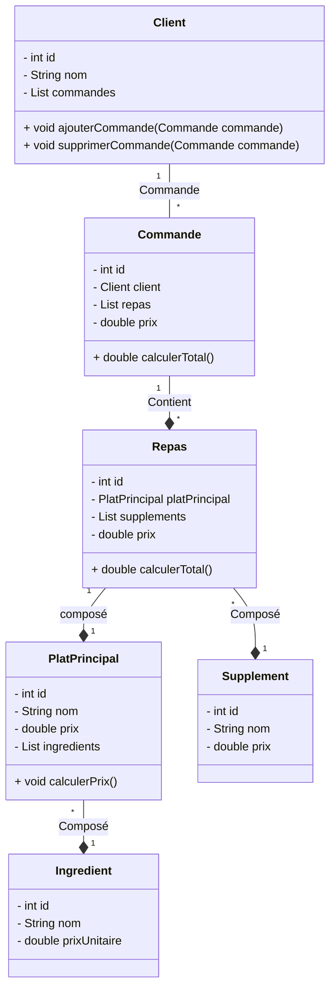

# Examen Java 2024/25

## 1. Diagrammes de Classe

### 1. Diagramme de classe principale:


### 2. Digramme de classe DAO:

```mermaid
classDiagram
    class ClientDAO {
        - Connection connexion
        + List<Client> listeClients()
        + void creerClient(Client client)
        + Client chercheClient(int id)
        + void modifierClient(Client client)
        + void supprimerClient(int id)
    }

    class PlatPrincipalDAO {
        - Connection connexion
        + List<PlatPrincipal> listePlatsPrincipaux()
        + void ajouterPlatPrincipal(PlatPrincipal plat)
        + PlatPrincipal cherchePlatPrincipal(int id)
        + void modifierPlatPrincipal(PlatPrincipal plat)
        + void supprimerPlatPrincipal(int id)
    }

    class IngredientDAO {
        - Connection connexion
        + List<Ingredient> listeIngredients()
        + void ajouterIngredient(Ingredient ingredient)
        + Ingredient chercheIngredient(int id)
        + void modifierIngredient(Ingredient ingredient)
        + void supprimerIngredient(int id)
    }

    class SupplementDAO {
        - Connection connexion
        + List<Supplement> listeSupplements()
        + void ajouterSupplement(Supplement supplement)
        + Supplement chercheSupplement(int id)
        + void modifierSupplement(Supplement supplement)
        + void supprimerSupplement(int id)
    }

    class CommandeDAO {
        - Connection connexion
        + List<Supplement> listeCommandes()
        + void ajouterCommande(Commande commande)
        + Commande chercheCommande(int id)
        + void modifierCommande(Commande commande)
        + void supprimerCommande(int id)
    }

    class RepasDAO {
        - Connection connexion
        + List<Supplement> listeRepass()
        + void ajouterRepas(Repas repas)
        + Repas chercheRepas(int id)
        + void modifierRepas(Repas repas)
        + void supprimerRepas(int id)
    }

    class SingletonConnexionDB {
        -String url
        -String user
        -String password
        + Connection getConnection()
    }

    SingletonConnexionDB "1" -- "*" ClientDAO: Utilise
    SingletonConnexionDB "1" -- "*" PlatPrincipalDAO: Utilise
    SingletonConnexionDB "1" -- "*" IngredientDAO: Utilise
    SingletonConnexionDB "1" -- "*" SupplementDAO: Utilise
    SingletonConnexionDB "1" -- "*" CommandeDAO: Utilise
    SingletonConnexionDB "1" -- "*" RepasDAO: Utilise
```


## 2. Diagramme MLD
````plantuml
@startuml

!theme plain
top to bottom direction
skinparam linetype ortho

class client {
   nom: varchar(100)
   id: int
}
class commande {
   client_id: int
   id: int
}
class commande_repas {
   commande_id: int
   repas_id: int
}
class ingredient {
   nom: varchar(100)
   prix: decimal(10,2)
   id: int
}
class platprincipal {
   nom: varchar(100)
   id: int
}
class platprincipal_ingredient {
   platprincipal_id: int
   ingredient_id: int
}
class repas {
   platprincipal_id: int
   id: int
}
class repas_supplement {
   repas_id: int
   supplement_id: int
}
class supplement {
   nom: varchar(100)
   prix: decimal(10,2)
   id: int
}

commande                  -[#595959,plain]-^  client                   : "client_id:id"
commande_repas            -[#595959,plain]-^  commande                 : "commande_id:id"
commande_repas            -[#595959,plain]-^  repas                    : "repas_id:id"
platprincipal_ingredient  -[#595959,plain]-^  ingredient               : "ingredient_id:id"
platprincipal_ingredient  -[#595959,plain]-^  platprincipal            : "platprincipal_id:id"
repas                     -[#595959,plain]-^  platprincipal            : "platprincipal_id:id"
repas_supplement          -[#595959,plain]-^  repas                    : "repas_id:id"
repas_supplement          -[#595959,plain]-^  supplement               : "supplement_id:id"
@enduml

````
## 3. Tables MySQL

### Client Table
```sql
CREATE TABLE Client (
                        id INT PRIMARY KEY AUTO_INCREMENT,
                        nom VARCHAR(100) NOT NULL
);
```

### PlatPrincipal Table
```sql
CREATE TABLE PlatPrincipal (
    id INT PRIMARY KEY AUTO_INCREMENT,
    nom VARCHAR(100) NOT NULL
);
```

### Ingredient Table
```sql
CREATE TABLE Ingredient (
    id INT PRIMARY KEY AUTO_INCREMENT,
    nom VARCHAR(100) NOT NULL,
    prix DECIMAL(10, 2) NOT NULL
);
```

### Supplement Table
```sql
CREATE TABLE Supplement (
    id INT PRIMARY KEY AUTO_INCREMENT,
    nom VARCHAR(100) NOT NULL,
    prix DECIMAL(10, 2) NOT NULL
);
```

### Junction Table for PlatPrincipal and Ingredient
```sql
CREATE TABLE PlatPrincipal_Ingredient (
    platprincipal_id INT,
    ingredient_id INT,
    FOREIGN KEY (platprincipal_id) REFERENCES PlatPrincipal(id),
    FOREIGN KEY (ingredient_id) REFERENCES Ingredient(id),
    PRIMARY KEY (platprincipal_id, ingredient_id)
);
```

### Repas Table
```sql
CREATE TABLE Repas (
    id INT PRIMARY KEY AUTO_INCREMENT,
    platprincipal_id INT NOT NULL,
    FOREIGN KEY (platprincipal_id) REFERENCES PlatPrincipal(id)
);
```

### Junction Table for Repas and Supplement
```sql
CREATE TABLE Repas_Supplement (
    repas_id INT,
    supplement_id INT,
    FOREIGN KEY (repas_id) REFERENCES Repas(id),
    FOREIGN KEY (supplement_id) REFERENCES Supplement(id),
    PRIMARY KEY (repas_id, supplement_id)
);
```

### Commande Table
```sql
CREATE TABLE Commande (
    id INT PRIMARY KEY AUTO_INCREMENT,
    client_id INT NOT NULL,
    FOREIGN KEY (client_id) REFERENCES Client(id)
);
```

### Junction Table for Commande and Repas
```sql
CREATE TABLE Commande_Repas (
    commande_id INT,
    repas_id INT,
    FOREIGN KEY (commande_id) REFERENCES Commande(id),
    FOREIGN KEY (repas_id) REFERENCES Repas(id),
    PRIMARY KEY (commande_id, repas_id)
);
```


## 4. Classes Java

### Client.java
```java
public class Client {
    private int id;
    private String nom;
    private List<Commande> commandes;

    public Client(int id, String nom, List<Commande> commandes) {
        this.id = id;
        this.nom = nom;
        this.commandes = commandes;
    }
}
```

### Commande.java
```java
public class Commande {
    private int id;
    private Client client;
    private List<Repas> repas;
    private double prix;


    public Commande(int id, Client client, List<Repas> repas) {
        this.id = id;
        this.client = client;
        this.repas = repas;
    }

    private void calculatePrix() {
        for (Repas repas : repas) {
            this.prix += repas.getPrix();
        }
    }

    public Commande(int id, Client client) {
        this.id = id;
        this.client = client;
        this.repas = new ArrayList<>();
    }

    public void ajouterRepas(Repas repas) {
        this.repas.add(repas);
    }

    public void deleteRepas(Repas repas) {
        this.repas.remove(repas);
    }
}
```
### PlatPrincipal.java
````java
public class PlatPrincipal {
private  int id;
private String nom;
private double prix;
private List<Ingredient> ingredients;

    public PlatPrincipal(int id, String nom, List<Ingredient> ingredients) {
        this.id = id;
        this.nom = nom;
        this.ingredients = ingredients;
        this.calculatePrice();
    }

    private void calculatePrice() {
        for (Ingredient ingredient : ingredients) {
            this.prix += ingredient.getPrix();
        }
    }
}
````
### Commande.java
````java
public class Commande {
private int id;
private Client client;
private List<Repas> repas;
private double prix;


    public Commande(int id, Client client, List<Repas> repas) {
        this.id = id;
        this.client = client;
        this.repas = repas;
    }

    private void calculatePrix() {
        for (Repas repas : repas) {
            this.prix += repas.getPrix();
        }
    }}
````
### Ingredient.java
````java
public class Ingredient {
    private  int id;
    private String nom;
    private double prix;

    public Ingredient(int id, String nom, double prix) {
        this.id = id;
        this.nom = nom;
        this.prix = prix;
    }}
````
### Repas.java
````java
public class Repas {
    private int id;
    private PlatPrincipal platPrincipal;
    private List<Supplement> supplement;
    private double prix;

    public Repas(int id, PlatPrincipal platPrincipal, List<Supplement> supplement) {
        this.id = id;
        this.platPrincipal = platPrincipal;
        this.supplement = supplement;
        this.calculatePrice();
    }

    private void calculatePrice() {
        this.prix = platPrincipal.getPrix();
        for (Supplement supplement : supplement) {
            this.prix += supplement.getPrix();
        }

        this.prix += platPrincipal.getPrix();
    }
}
````
### Supplement.java

````java
public class Supplement {
    private  int id;
    private String nom;
    private  double prix;

    public Supplement(int id, String nom, double prix) {
        this.id = id;
        this.nom = nom;
        this.prix = prix;
    }

}
````
## 5.  Classes DAO
````java
public class PlatPrincipalDAO {
    private Connection connection;

    public static void main(String[] args) throws SQLException {
        PlatPrincipalDAO platPrincipalDAO = new PlatPrincipalDAO();
        System.out.println(platPrincipalDAO.listePlatsPrincipaux());
    }
    
//    public List<>
    public List<PlatPrincipal> listePlatsPrincipaux() throws SQLException {
        List<PlatPrincipal> platPrincipals = new ArrayList<>();
        connection = SingletonConnexionDB.getConnection();
        PreparedStatement preparedStatement = connection.prepareStatement("SELECT * FROM platprincipal");
        ResultSet resultSet = preparedStatement.executeQuery();

        while (resultSet.next()) {
            int id = resultSet.getInt("id");
            String nom = resultSet.getString("nom");
            PlatPrincipal platPrincipal = new PlatPrincipal(id, nom, getIngredientForPlat(id));
            platPrincipals.add(platPrincipal);
        }
        preparedStatement.executeQuery();

        return platPrincipals;
    }

private List<Ingredient> getIngredientForPlat(int id) throws SQLException {
        List<Ingredient> ingredients = new ArrayList<>();
        connection = SingletonConnexionDB.getConnection();
        PreparedStatement preparedStatement = connection.prepareStatement("SELECT i.id, i.nom, i.prix FROM platprincipal as pp join examenjava2425.platprincipal_ingredient pi on pp.id = pi.platprincipal_id  JOIN examenjava2425.ingredient i on i.id = pi.ingredient_id WHERE pp.id = ?;");
        preparedStatement.setInt(1, id);
        ResultSet resultSet = preparedStatement.executeQuery();
        while (resultSet.next()){
            int idIngredient = resultSet.getInt("i.id");
            String nom = resultSet.getString("i.nom");
            double prix = resultSet.getDouble("i.prix");
            Ingredient ingredient = new Ingredient(idIngredient, nom, prix);
            ingredients.add(ingredient);
        }
        return ingredients;
}

}

````
## 6. 
## 7. 
## 8. 
## 9. 
## 10. 
## 11. 
## 12. 
