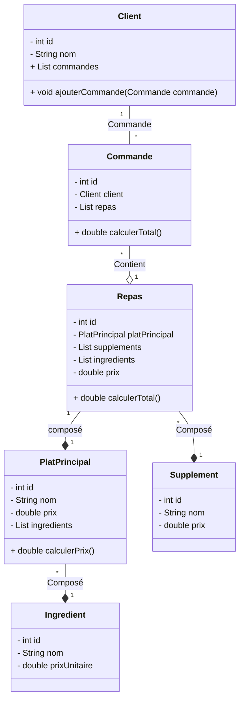
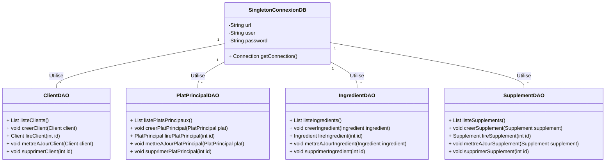

# Examen Java 2024/25

## 1. Diagrammes de Classe

### 1. Diagramme de classe principale:


### 2. Digramme de classe DAO:


## 2. Diagramme MLD

## 3. Tables MySQL

```mysql
```

## 4. 
## 5.  
## 6. 
## 7. 
## 8. 
## 9. 
## 10. 
## 11. 
## 12. 
